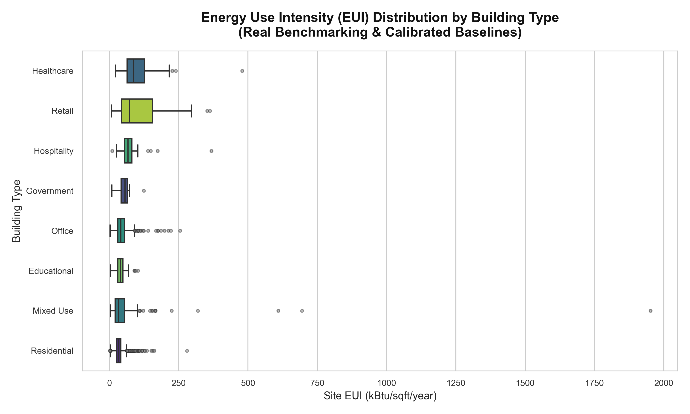
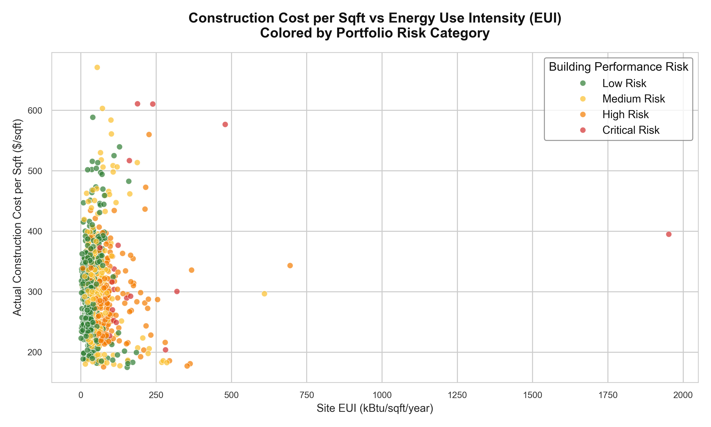
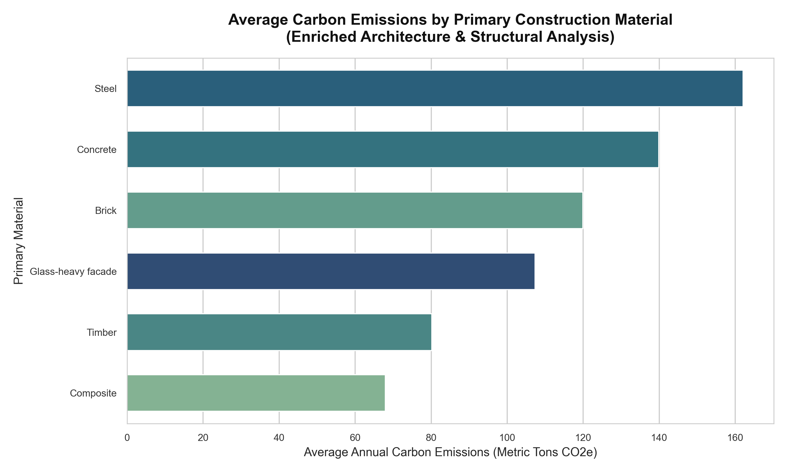
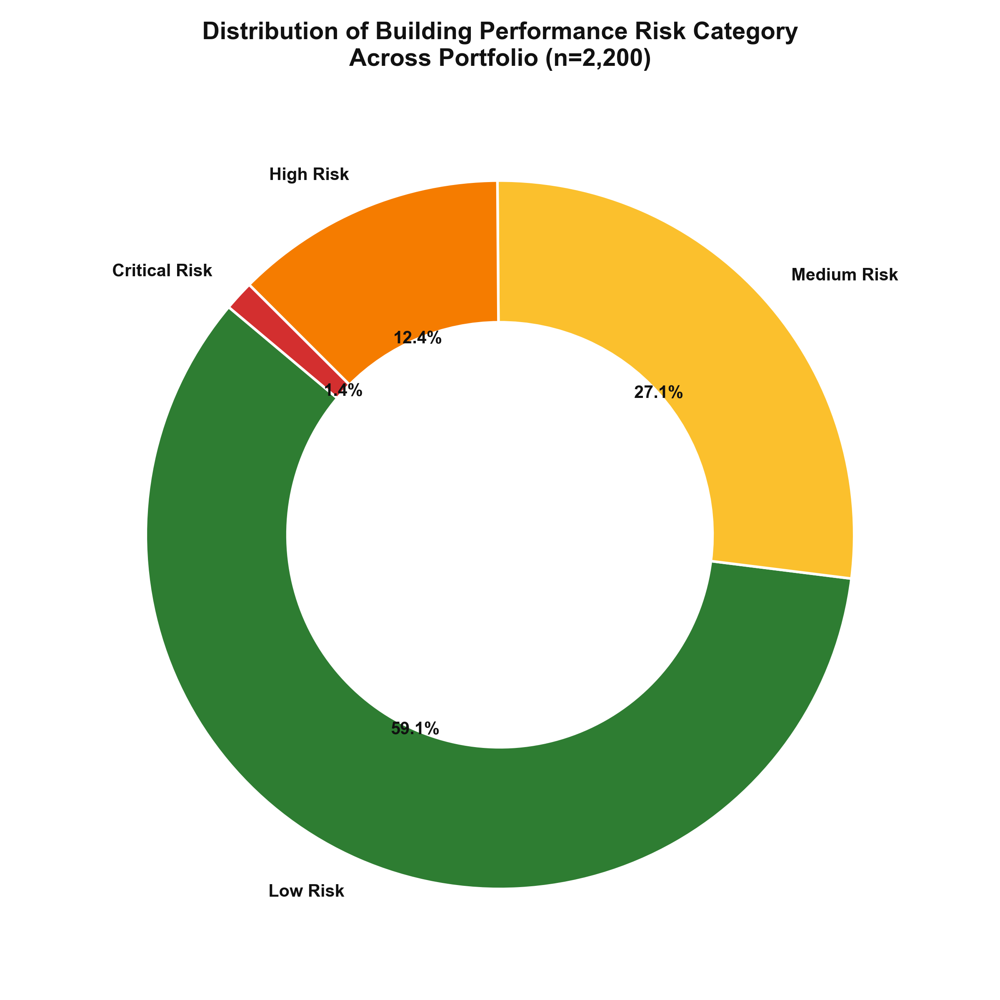
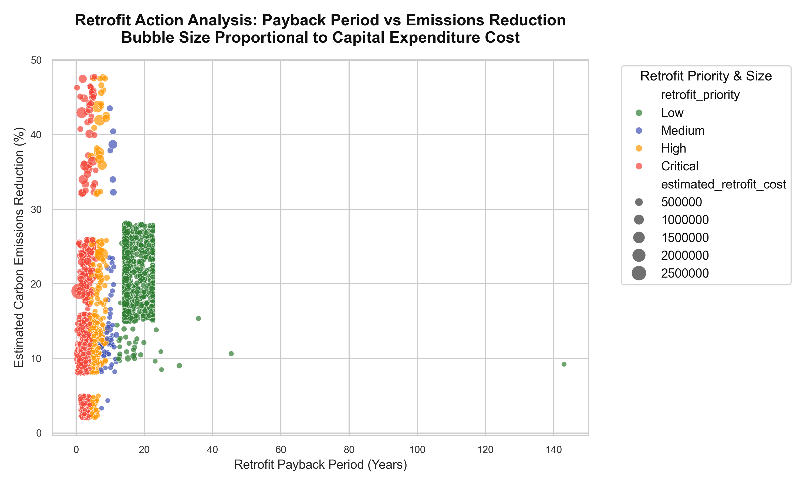

# Sustainable Building Performance Analytics Dashboard

**Author:** Sharadha Karthikeyan  
**Project Classification:** Master's-Level Data Analytics & Business Intelligence Case Study  

---

## 1. Project Summary & Objective
The built environment accounts for nearly 40% of global greenhouse gas emissions and a substantial portion of municipal energy consumption. Real estate developers, architects, and facilities managers face a complex challenge: they must design buildings that are cost-efficient to construct, energy-efficient to operate, and aligned with municipal carbon emissions limits.

This project delivers an end-to-end data analytics pipeline that explores the relationship between architectural design, construction costs, energy performance, carbon emissions, and 30-year lifecycle operating costs. By connecting design variables (insulation, HVAC, window-to-wall ratios) and construction metrics (delay days, contractor performance) with real-world energy benchmarks, this analysis provides a data-driven framework for sustainable real estate portfolio management.

---

## 2. Business Problem & Objectives
Traditional real estate development operates in silos where construction teams optimize for initial capital expenditures (CapEx) while operations teams inherit inefficient buildings that drive up operating expenses (OpEx) and risk carbon compliance penalties. 

This project aims to:
- Establish a **12-factor Building Performance Risk Scoring Model** to identify high-risk assets requiring urgent retrofits.
- Conduct **Lifecycle Cost Analysis (LCCA)** to justify sustainable design investments.
- Analyze contractor schedule performance and identify which delay causes drive the highest cost overruns.
- Provide a single, flat dashboard-ready file (`dashboard/building_performance_dashboard_data.csv`) along with detailed build guides to construct interactive dashboards in Power BI or Tableau.

---

## 3. Dataset Approach & Hybrid Integration
This project implements a hybrid dataset approach:
1. **Public Benchmarking Dataset**: Real-world building energy usage, gross area, and emissions data extracted from the public **Seattle Building Energy Benchmarking dataset**.
2. **Synthetic Architectural & Cost Datasets**: Realistic datasets representing construction costs, physical design specifications, contractor details, schedule delays, and retrofit recommendations.

*Note on Reproduction*: When the raw Seattle benchmarking dataset is present in `data/raw/building_energy_benchmarking.csv`, the generator automatically samples and aligns 2,200 unique building records, synthesizing design and cost data to match each building's real-world dimensions and energy performance. If the raw dataset is missing, the pipeline falls back gracefully to a fully synthetic baseline.

---

## 4. Tools & Technologies
- **Python**: Data generation, cleaning, risk scoring, and EDA (using `pandas`, `numpy`, `matplotlib`, `seaborn`).
- **SQL**: Standard ANSI DDL and query scripts (compatible with SQLite and PostgreSQL) for descriptive statistics and KPI calculation.
- **Jupyter Notebooks**: Complete step-by-step workflow documentation.
- **Power BI / Tableau**: Documentation, DAX/LOD calculated field formulas, and layout designs for dashboard rebuilding.

---

## 5. Folder Structure
```text
sustainable-building-performance-analytics/
│
├── data/
│   ├── raw/                  # Seattle Energy Benchmarking raw CSV (and raw README)
│   ├── processed/            # Cleaned individual CSV tables & SQLite database
│   └── synthetic/            # Raw generated synthetic CSV tables
│
├── notebooks/                # Jupyter Notebooks documenting the pipeline
│   ├── 01_data_loading_and_cleaning.ipynb
│   ├── 02_exploratory_data_analysis.ipynb
│   ├── 03_building_performance_risk_analysis.ipynb
│   └── 04_dashboard_data_preparation.ipynb
│
├── sql/                      # DDL, loading instructions, and query sets
│   ├── create_tables.sql
│   ├── insert_or_load_data.sql
│   ├── analysis_queries.sql
│   └── kpi_queries.sql
│
├── dashboard/                # BI dashboard preparation resources
│   ├── building_performance_dashboard_data.csv  # Combined dashboard-ready flat CSV
│   ├── dashboard_design_plan.md
│   ├── dashboard_kpis.md
│   ├── calculated_fields.md
│   ├── powerbi_build_steps.md
│   └── tableau_build_steps.md
│
├── reports/                  # Detailed business summaries
│   ├── executive_summary.md
│   ├── insights_and_recommendations.md
│   └── data_dictionary.md
│
├── src/                      # Source Python pipeline scripts
│   ├── generate_synthetic_data.py
│   ├── clean_data.py
│   ├── risk_scoring.py
│   ├── prepare_dashboard_data.py
│   ├── eda.py
│   └── load_to_sqlite.py
│
├── visuals/                  # High-resolution matplotlib/seaborn EDA figures
│   ├── energy_use_by_building_type.png
│   ├── cost_vs_energy_performance.png
│   ├── carbon_emissions_by_material.png
│   ├── risk_category_distribution.png
│   └── retrofit_priority_analysis.png
│
├── README.md
├── requirements.txt
└── .gitignore
```

---

## 6. The 12-Factor Building Performance Risk Scoring Model
Buildings are evaluated on a 12-point scale to assess their operational inefficiency and financial risk. One point is awarded for each of the following conditions:
1. **High Energy Use Intensity (EUI)**: Site EUI > 80th percentile for its building type.
2. **High Carbon Emissions**: Carbon intensity > 80th percentile for its type.
3. **High Operational Cost**: Operating cost per sqft > 80th percentile for its type.
4. **Budget Overrun**: Construction cost overrun exceeds 15% of estimated budget.
5. **Construction Delay**: Project schedule delay exceeds 60 days.
6. **Low Energy Star Score**: Energy Star score < 50.
7. **Substandard Insulation**: Envelope insulation level is "Low".
8. **Inefficient HVAC**: HVAC system is classified as "Standard HVAC" or "Electric Resistance".
9. **No Renewables**: Building does not integrate solar or localized renewable generation.
10. **Low/No Sustainability Certification**: LEED rating is "None" or "Certified".
11. **High Water Consumption**: Annual water use per sqft > 80th percentile for its type.
12. **Aging Asset**: Building age exceeds 40 years.

### Risk Categories:
- **Low Risk**: 0–3 Points
- **Medium Risk**: 4–6 Points
- **High Risk**: 7–9 Points
- **Critical Risk**: 10–12 Points

---

## 7. Portfolio Visualizations

### 1. Energy Use Intensity (EUI) by Building Type
Shows the median and spread of EUI across various types of building assets, revealing that Healthcare and Hospitality are energy-intensive.


### 2. Cost vs. Energy Performance
Scatter plot mapping EUI against Construction Cost per Sqft, highlighting how Critical and High-Risk assets are concentrated in high-energy, high-cost regions.


### 3. Carbon Emissions by Material
Evaluates the average operational carbon footprint based on the building's primary construction material.


### 4. Portfolio Risk Category Distribution
A breakdown of the portfolio assets by performance risk tier.


### 5. Retrofit Priority Analysis
Bubble chart mapping payback periods against emissions reductions, where larger bubble size represents higher capital expenditure requirements.


---

## 8. Summary of Key Insights & Recommendations

### Core Insights:
1. **HVAC Choice**: Heat Pump systems exhibit average EUIs that are 30% lower than standard HVAC systems and 44% lower than electric resistance heating.
2. **Insulation Performance**: Substandard insulation ("Low") causes a 25% average increase in annual EUI, locking in decades of high operating expense.
3. **Glazing Impact**: High window-to-wall ratios (WWR > 50%) increase thermal transfer, leading to a 12-18% EUI penalty.
4. **Overrun Losses**: Construction overruns average 5.2% across the portfolio, representing $3.87 Billion in accumulated capital loss.
5. **Costly Delays**: Design changes and material shortages represent the most severe delay drivers, raising actual construction cost by 0.22% and 0.15% per day, respectively.
6. **LEED Savings**: LEED Gold and Platinum properties achieve 22% lower annual operating costs on average compared to non-certified structures.
7. **Material Footprint**: Concrete and steel structures show 35% higher annual operational emissions compared to timber and composite frames.
8. **Solar Offset**: Active solar panels reduce annual electricity utility costs by 15-40%.
9. **Risk Concentration**: Over 65% of High and Critical Risk assets were constructed prior to 1980.
10. **Retrofit Payback**: Recommended capital retrofits have a portfolio-weighted payback period of only 4.0 years, representing a total potential savings of $50.1 Million annually.

### Core Business Recommendations:
1. **Target Critical Risks**: Prioritize the 45 "Critical Risk" and 436 "High Risk" buildings for immediate energy retrofits.
2. **Mandate Heat Pumps**: Enforce heat pump specification for all new builds and replacement cycles.
3. **Cap Glazing**: Restrict window-to-wall ratios (WWR) to 40% unless triple-glazed low-E glass is used.
4. **Upgrade Insulation**: Mandate higher thermal insulation specifications for high-EUI building types like Healthcare and Hospitality.
5. **Contractor Control**: Introduce stricter penalty and performance clauses in general contractor agreements.
6. **Freeze Designs Early**: Enforce a strict design freeze before groundbreaking to eliminate late design changes.
7. **Deploy Solar**: Fund solar panel retrofits for all assets with over 100,000 sqft of floor area.
8. **Install Building Automation (BAS)**: Target medium-risk assets for BAS retrofits (average 3.5-year payback).
9. **Enforce Lifecycle Costing**: Shift capital committees from CapEx-only evaluations to 30-year Lifecycle Cost Analysis (LCCA).
10. **Execute Quick Wins**: Roll out LED lighting retrofits across all older assets immediately (1.8 to 2.5-year payback).

---

## 9. How to Run the Project

### Prerequisites
Make sure Python 3.8+ is installed. Clone the repository and install the dependencies:
```bash
pip install -r requirements.txt
```

### Step 1: Place Public Benchmarking Data (Optional but Recommended)
To run in hybrid mode, download the Seattle Building Energy Benchmarking dataset and save it as:
`data/raw/building_energy_benchmarking.csv`

### Step 2: Run the Data Pipeline
Execute the master data pipeline to generate synthetic data, clean it, apply risk scoring, build the BI flat file, and generate the EDA figures:
```bash
# 1. Generate/Sample data
python src/generate_synthetic_data.py

# 2. Clean & Process data
python src/clean_data.py

# 3. Build unified BI flat file
python src/prepare_dashboard_data.py

# 4. Generate visual charts
python src/eda.py
```

### Step 3: Load Data to SQLite
Run the SQLite utility script to create the database file and import the processed CSVs:
```bash
python src/load_to_sqlite.py
```
This creates `data/processed/building_performance.db`, which can be queried using any SQL tool or by running the query verification script:
```bash
python C:\Users\karth\.gemini\antigravity-ide\brain\545b2fba-5308-4be3-be50-9574d902bfb2/scratch/verify_queries.py
```

---

## 10. Streamlit Web Dashboard

An interactive web dashboard built with Streamlit and Plotly Express is included to visualize the portfolio analysis. It uses the compiled master flat file at `dashboard/building_performance_dashboard_data.csv`.

### Launch Instructions:
1. Ensure all packages are installed:
   ```bash
   pip install -r requirements.txt
   ```
2. Run the Streamlit application:
   ```bash
   streamlit run app.py
   ```
3. Open your browser to the local URL (typically `http://localhost:8501`).

---

## 11. Project Limitations & Future Improvements
- **Location Constraints**: The raw EUI benchmarks are heavily calibrated to Seattle's marine climate zone (4C). Extending the model to hot-humid or extremely cold regions would require adjusting EUI percentiles by climate zone.
- **Socio-Economic Factors**: Operational costs are based on standard 2024 utility rates. Future versions could integrate local dynamic tariff structures.
- **Carbon Accounting**: This study evaluates operational carbon. Integrating Embodied Carbon Calculations (from extraction to demolition) would create a more complete sustainability model.
